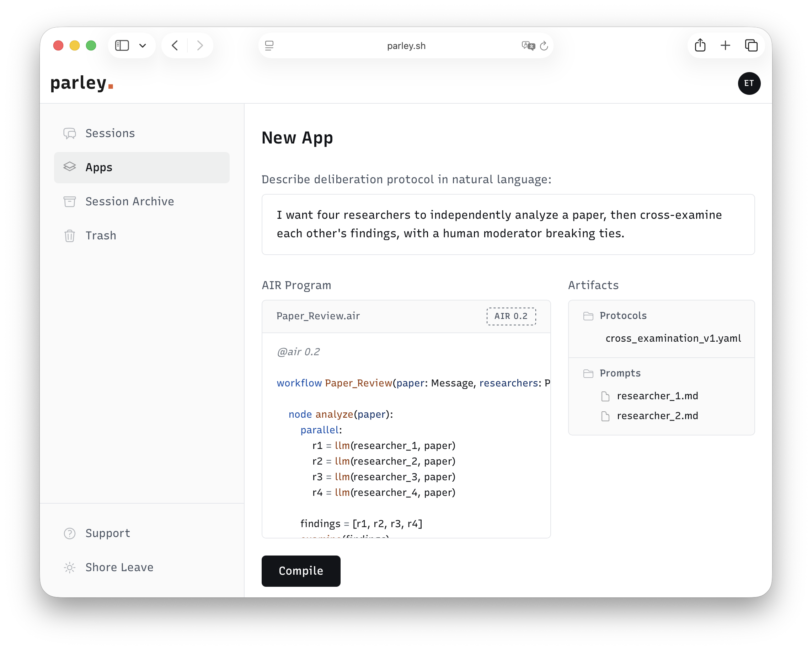

<p align="center">
  <h1 align="center">AIR</h1>
  <p align="center"><strong>Agentic Intermediate Representation</strong></p>
  <p align="center">
    The universal compiler stack for governed, auditable, and portable AI agent workflows.
  </p>
  <p align="center">
    <em>Write once in AIR. Run anywhere. Governed by design.</em>
  </p>
</p>

---

## The Problem

The AI agent ecosystem has two problems that make each other worse.

**Fragmentation.** Agent workflows are currently locked into specific vendor ecosystems, requiring complete rewrites to migrate between platforms like LangGraph and AWS Bedrock. The industry lacks a unified intermediate representation for control flow, state machines, and reasoning topologies. While protocols like MCP have successfully standardized tool integration, the workflow layer itself remains fragmented by ad-hoc transpilation scripts—very much like the software industry before LLVM.

**No governance.** Allowing unpredictable LLM outputs to drive immediate actions introduces unacceptable operational risk. High-stakes environments and regulations (like the EU AI Act or ISO 42001) demand rigorous safety measures, including explicit verification, immutable audit trails, and mandatory human oversight. Existing tools struggle to provide these architectural guarantees natively for high-risk AI systems.

## The Solution

AIR is a compiled language and IR that sits between high-level agent definitions and infrastructure-specific runtimes. The compiler validates governance constraints at compile time. The output is a portable JSON artifact that any backend can execute.

```
          Parley / DSPy / Visual Editors
                   (frontends)
                        ↓
                   AIR Language
                      (.air)
                        ↓
                   AIR Compiler
           (universal compiler & IR)
                        ↓
                    AIR Graph
   (.airc, portable, backend-agnostic artifact)
                        ↓
┌───────────────┬───────────────┬───────────────┐
│ AIR Agent VM  │  LangGraph    │  Bedrock /    │
│ (reference)   │  Backend      │  Azure / Dify │
└───────────────┴───────────────┴───────────────┘
                        ↓
   LLMs / Tools / Decision Providers / Humans
```



## Quick Example

An infrastructure change workflow where an LLM proposes Terraform plans but can never execute them without passing verification and human approval:

```air
@air 0.2 [mode=strict]

workflow AWS_Config_Update(intent: Message) -> Artifact | Fault:

    node plan_change:
        # LLM proposes the infrastructure change and not allowed to execute without approval.
        proposal = transform(intent) as TfPlan via llm(generate_tf_plan)

        route proposal:
            Fault: abort
            else: evaluate_risk(proposal)

    node evaluate_risk(proposal):
        # Deterministic rule blocks destructive operations (e.g., "destroy")
        verdict, evidence = verify(proposal, prevent_resource_deletion)
        outcome = gate(verdict)

        route outcome:
            PROCEED: execute(proposal)
            ESCALATE: require_human(proposal, evidence)
            HALT: abort

    node require_human(proposal, evidence):
        # Mandatory human-in-the-loop for flagged high-risk changes
        msg, outcome = decide(platform_engineer, proposal)

        route outcome:
            PROCEED: execute(proposal)
            HALT: abort

    node execute(proposal):
        # This tool is completely unreachable without passing the gates above.
        result = tool(apply_terraform, proposal)
        return Artifact(status="applied", result=result)

    node abort:
        return Fault(reason="Change rejected or policy violated")
```

In strict mode, the compiler guarantees that `apply_terraform` cannot be reached without passing through `verify → gate`. This is enforced at compile time.

## Key Features

### Governance by Construction

AIR treats governance as a compiler concern.

```air
@air 0.2 [mode=strict]
```

In strict mode, the compiler rejects any workflow where an LLM output reaches a route without passing through `verify → gate` first. This is a compile-time guarantee.

```
generate → extract → verify → gate → route
```

### Human-in-the-Loop

The `decide` instruction puts humans in the decision loop with structured outcomes:

```air
msg, outcome = decide(human_reviewer, summary)

route outcome:
    PROCEED: publish(summary)
    RETRY: analyze
    ESCALATE: abort
```

Decision providers are pluggable. Swap between terminal prompts, web UIs, or API webhooks:

```bash
air run workflow.airc --callback my_tui:fancy_callback
```

### Multi-Agent Deliberation Protocols

The `session` instruction runs multi-participant deliberation with structured consensus:

```air
consensus, transcript = session(members, parley_v1, history)

route consensus:
    PROCEED: publish(summary, transcript)
    RETRY: start
    else: reject(transcript)
```

Protocols are self-describing YAML assets — turn order, legal moves, resolution strategy:

```yaml
name: parley_v1
turn_order: round_robin
moves: [DISCUSS, PROPOSE, AGREE, COUNTER, QUESTION]
resolution:
  strategy: unanimous
  outcomes:
    AGREE: PROCEED
    COUNTER: RETRY
  default: ESCALATE
```

### Multi-Model Orchestration

Each prompt asset declares its own model. Mix providers within a single workflow:

```yaml
# prompts/summarize.yaml
model: gemini/gemini-2.0-flash
template: |
  Summarize the following: {{input}}
```

```yaml
# prompts/synthesize.yaml
model: gpt-4o-mini
template: |
  Synthesize these summaries into a report: {{input}}
```

### Parallel Execution

`map` for concurrent sub-workflows, `parallel` for independent operations within a node:

```air
summaries = map(articles, SummarizeItem) [concurrency=3]

parallel:
    v1 = verify(claims, rule_a)
    v2 = verify(claims, rule_b)
```

### Compiler-Enforced Correctness

AIR shifts workflow validation to compile time, eliminating an entire class of runtime orchestration errors before a single token is generated or a single API is called:

* **Immutability (SSA)** — Variables cannot be silently overwritten within a node, preventing hidden state mutations.
* **Strict Scoping** — All variable references and asset dependencies are statically verified.
* **Exhaustive Routing** — Every possible outcome—especially failures (`Fault`) and edge cases—must have an explicit control path.
* **Type Safety** — Constructed outputs are guaranteed to strictly adhere to the workflow's declared return signature.
* **Deterministic Termination** — Enforces that every node explicitly ends with a valid transition, route, or return.
* **Sub-workflow Integrity** — Validates that concurrent `map` operations target known workflows with compatible input/output contracts.

### Portable IR

AIR compiles to AIR Graph (`.airc`), a JSON IR that any compatible runtime can execute:

- **AIR Agent VM** — the reference runtime (included)
- **LangGraph Backend** — generates executable Python
- Bedrock, Azure AI Foundry, Agent Spec, Dify

## How It Works

### Design Principles

| Principle | Meaning |
|-----------|---------|
| Deterministic Orchestration | Control flow is always predictable. Only `llm`, `decide`, and `session` are stochastic. |
| Governance by Construction | Strict mode rejects programs where LLM outputs reach routes without verification. |
| First-Class Faults | Failures are typed values (`Fault`). They flow through the graph like data. |
| Auditability | Every reasoning step, verification result, and decision is explicitly represented. |
| Portability | Compile to `.airc`, run on any backend. |

### Instruction Set

| Category | Instruction | What it does |
|----------|-------------|-------------|
| Generation | `llm(prompt, args...)` | LLM content generation |
| Extraction | `transform(value) as Type via llm(prompt)` | Structured data extraction |
| Extraction | `transform(value) as Type via func(name)` | Deterministic transformation |
| Verification | `verify(input, rule)` | Rule-based claim verification |
| Aggregation | `aggregate([verdicts], strategy)` | Multi-verdict consensus |
| Gate | `gate(verdict\|consensus)` | Verdict → governance outcome |
| Decision | `decide(provider, input?)` | Human or automated decision point |
| Collaboration | `session(members, protocol, history)` | Multi-agent deliberation |
| Composition | `map(collection, Workflow) [concurrency=N]` | Parallel sub-workflows |
| Execution | `tool(name, args...)` | External tool invocation |
| Control Flow | `route value:` | Conditional branching |
| Control Flow | `parallel:` | Concurrent execution |

### Built-in Types

`Message` · `Artifact` · `Fault` · `Verdict` · `Consensus` · `Outcome` · `Evidence` · `Claim[]`

## Compliance

AIR was designed with regulatory requirements in mind:

| Standard | How AIR helps |
|----------|---------------|
| EU AI Act | Human oversight via `decide`, auditable governance chains, strict mode enforcement |
| ISO 42001 | Typed workflows, verification chains, explicit decision points |
| NIST AI RMF | `verify → gate` pipelines, bounded retries (`[max=N]`), fault-typed error handling |

## Current Implementation

### Compiler

```
.air → Lark Parser → AST → Semantic Checker → CFG → AIR Graph → .airc
```

### Agent VM

| Executor | Operation | Implementation |
|----------|-----------|----------------|
| `LLMExecutor` | `llm` | litellm (any provider) |
| `TransformExecutor` | `transform` | LLM, func, or coerce modes |
| `VerifyExecutor` | `verify` | LLM-based rule evaluation |
| `AggregateExecutor` | `aggregate` | Unanimous/majority strategies |
| `GateExecutor` | `gate` | Verdict/Consensus → Outcome |
| `DecisionExecutor` | `decide` | Pluggable human callback |
| `SessionExecutor` | `session` | Round-robin + deterministic consensus |
| `ToolExecutor` | `tool` | Python callable resolution |
| `MapExecutor` | `map` | Parallel sub-workflows via ThreadPool |

### Backends

- **LangGraph** — generates executable Python code from `.airc`
- Bedrock, Azure AI Foundry, Agent Spec, Dify

## Getting Started

### Installation

```bash
git clone https://github.com/airlang-dev/air.git
cd air

# With uv (recommended)
uv sync

# Or with pip
python -m venv .venv
source .venv/bin/activate
pip install -e .
```

### Configure API Keys

Create a `.env` file with your LLM provider keys:

```bash
GOOGLE_API_KEY=your-key
OPENAI_API_KEY=your-key
ANTHROPIC_API_KEY=your-key
```

### Compile & Run

```bash
# Compile an AIR program
air compile examples/v0.2/FactCheckedPublish.air

# Run a compiled workflow
air run build/FactCheckedPublish.airc \
  --assets assets/ \
  --input content="2 x 2 = 5"

# Generate a LangGraph backend
air backend langgraph build/FactCheckedPublish.airc

# Run tests
python -m pytest tests/ -v
```

## License

MIT

---

<p align="center">
  AI agents should be governed by design, not by accident.
</p>
